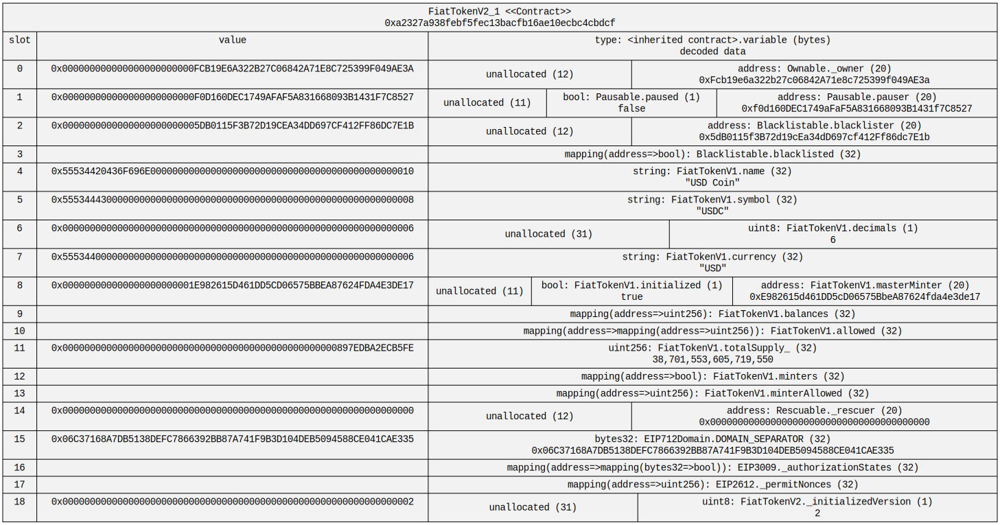
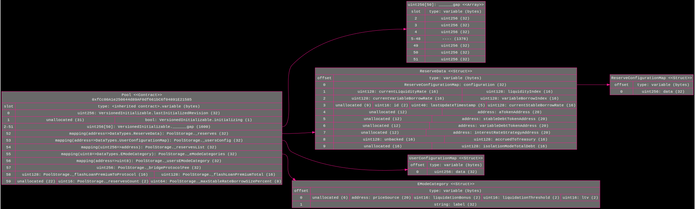

# Solidity 2 UML

[](https://www.npmjs.com/package/sol2uml)
[](https://twitter.com/naddison)

A visualisation tool for [Solidity](https://solidity.readthedocs.io/) contracts featuring:
1. [Unified Modeling Language (UML)](https://en.wikipedia.org/wiki/Unified_Modeling_Language) [class diagram](https://en.wikipedia.org/wiki/Class_diagram) generator for Solidity contracts.
2. Contract storage layout diagrams.
3. Flatten Solidity files on Etherscan-like explorers to a local file.
4. Diff contracts on Etherscan-like explorers.

UML class diagram of Open Zeppelin's ERC20 token contracts generated from [version 4.7.3](https://github.com/OpenZeppelin/openzeppelin-contracts/tree/v4.7.3/contracts/token/ERC20)


See more contract diagrams [here](./examples/README.md).

Storage layout diagram of USDC's [verified source code](https://etherscan.io/address/0xa2327a938febf5fec13bacfb16ae10ecbc4cbdcf#code) on Etherscan.


See an explanation of how storage diagrams work with lots of examples [here](./examples/storage/README.md#example-storage-diagrams).

# Install

The following installation assumes [Node.js](https://nodejs.org/en/download/) has already been installed which comes with [Node Package Manager (NPM)](https://www.npmjs.com/).
`sol2uml` works with node 14 or above.

To install globally so you can run `sol2uml` from anywhere

```bash
npm link sol2uml --only=production
```

To upgrade run

```bash
npm upgrade sol2uml -g
```

To see which version you are using

```bash
npm ls sol2uml -g
```

# Usage

## Command Line Interface (CLI)

```
Usage: sol2uml [command] <options>

Generate UML class or storage diagrams from local Solidity code or verified Solidity code on Etherscan-like explorers.
Can also flatten or compare verified source files on Etherscan-like explorers.

Options:
  -sf, --subfolders <value>                       number of subfolders that will be recursively searched for Solidity files. (default: all)
  -f, --outputFormat <value>                      output file format. (choices: "svg", "png", "dot", "all", default: "svg")
  -o, --outputFileName <value>                    output file name
  -i, --ignoreFilesOrFolders <filesOrFolders>     comma-separated list of files or folders to ignore
  -n, --network <network>                         Ethereum network which maps to a blockchain explorer (choices: "mainnet", "goerli", "sepolia", "polygon", "arbitrum", "avalanche", "bsc", "crono", "fantom", "moonbeam", "optimism", "gnosis", "celo", "base", default: "mainnet", env: ETH_NETWORK)
  -e, --explorerUrl <url>                         Override the `network` option with a custom blockchain explorer API URL. eg Polygon Mumbai testnet https://api-testnet.polygonscan.com/api (env: EXPLORER_URL)
  -k, --apiKey <key>                              Blockchain explorer API key. eg Etherscan, Arbiscan, Optimism, BscScan, CronoScan, FTMScan, PolygonScan or SnowTrace API key (env: SCAN_API_KEY)
  -bc, --backColor <color>                        Canvas background color. "none" will use a transparent canvas. (default: "white")
  -sc, --shapeColor <color>                       Basic drawing color for graphics, not text (default: "black")
  -fc, --fillColor <color>                        Color used to fill the background of a node (default: "gray95")
  -tc, --textColor <color>                        Color used for text (default: "black")
  -v, --verbose                                   run with debugging statements (default: false)
  -V, --version                                   output the version number
  -h, --help                                      display help for command

Commands:
  class [options] <fileFolderAddress>             Generates a UML class diagram from Solidity source code.
  storage [options] <fileFolderAddress>           Visually display a contract's storage slots.
  
                                                  WARNING: sol2uml does not use the Solidity compiler so may differ with solc. A known example is fixed-sized arrays declared with an expression will fail to be sized.
  flatten <contractAddress>                       Merges verified source files for a contract from a Blockchain explorer into one local Solidity file.
  
                                                  In order for the merged code to compile, the following is done:
                                                  1. pragma solidity is set using the compiler of the verified contract.
                                                  2. All pragma solidity lines in the source files are commented out.
                                                  3. File imports are commented out.
                                                  4. "SPDX-License-Identifier" is renamed to "SPDX--License-Identifier".
                                                  5. Contract dependencies are analysed so the files are merged in an order that will compile.
  diff [options] <addressA> <fileFoldersAddress>  Compare verified Solidity code to another verified contract, a local file or local source files.
  
                                                  The results show the comparison of contract A to B.
                                                  The green sections are additions to contract B that are not in contract A.
                                                  The red sections are removals from contract A that are not in contract B.
                                                  The line numbers are from contract B. There are no line numbers for the red sections as they are not in contract B.
  help [command]                                  display help for command
```

### Class usage

```
Usage: sol2uml class [options] <fileFolderAddress>

Generates a UML class diagram from Solidity source code.

Arguments:
  fileFolderAddress                file name, folder(s) or contract address.
                                  When a folder is used, all *.sol files in that folder and all sub folders are used.
                                  A comma-separated list of files and folders can also be used. For example,
                                        sol2uml contracts,node_modules/@openzeppelin
                                  If an Ethereum address with a 0x prefix is passed, the verified source code from Etherscan will be used. For example
                                        sol2uml 0x79fEbF6B9F76853EDBcBc913e6aAE8232cFB9De9

Options:
  -b, --baseContractNames <value>  only output contracts connected to these comma separated base contract names
  -d, --depth <value>              depth of connected classes to the base contracts. 1 will only show directly connected contracts, interfaces, libraries, structs and enums. (default: all)
  -c, --clusterFolders             cluster contracts into source folders (default: false)
  -hv, --hideVariables             hide variables from contracts, interfaces, structs and enums (default: false)
  -hf, --hideFunctions             hide functions from contracts, interfaces and libraries (default: false)
  -hp, --hidePrivates              hide private and internal attributes and operators (default: false)
  -hm, --hideModifiers             hide modifier functions from contracts (default: false)
  -ht, --hideEvents                hide events from contracts, interfaces and libraries (default: false)
  -hc, --hideConstants             hide file level constants (default: false)
  -hx, --hideContracts             hide contracts (default: false)
  -he, --hideEnums                 hide enum types (default: false)
  -hs, --hideStructs               hide data structures (default: false)
  -hl, --hideLibraries             hide libraries (default: false)
  -hi, --hideInterfaces            hide interfaces (default: false)
  -ha, --hideAbstracts             hide abstract contracts (default: false)
  -hn, --hideFilename              hide relative path and file name (default: false)
  -s, --squash                     squash inherited contracts to the base contract(s) (default: false)
  -hsc, --hideSourceContract       hide the source contract when using squash (default: false)
  -h, --help                       display help for command
```

### Storage usage

```
Usage: sol2uml storage [options] <fileFolderAddress>

Visually display a contract's storage slots.

WARNING: sol2uml does not use the Solidity compiler so may differ with solc. A known example is fixed-sized arrays declared with an expression will fail to be sized.

Arguments:
  fileFolderAddress               file name, folder(s) or contract address.
                                  When a folder is used, all *.sol files in that folder and all sub folders are used.
                                  A comma-separated list of files and folders can also be used. For example
                                        sol2uml contracts,node_modules/openzeppelin-solidity
                                  If an Ethereum address with a 0x prefix is passed, the verified source code from Etherscan will be used. For example
                                        sol2uml 0x79fEbF6B9F76853EDBcBc913e6aAE8232cFB9De9

Options:
  -c, --contract <name>           Contract name in the local Solidity files. Not needed when using an address as the first argument as the contract name can be derived from Etherscan.
  -cf, --contractFile <filename>  Filename the contract is located in. This can include the relative path to the desired file.
  -d, --data                      Gets the values in the storage slots from an Ethereum node. (default: false)
  -s, --storage <address>         The address of the contract with the storage values. This will be different from the contract with the code if a proxy contract is used. This is not needed if `fileFolderAddress` is an address and the contract is not proxied.
  -u, --url <url>                 URL of the Ethereum node to get storage values if the `data` option is used. (default: "http://localhost:8545", env: NODE_URL)
  -bn, --block <number>           Block number to get the contract storage values from. (default: "latest")
  -a, --array <number>            Number of slots to display at the start and end of arrays. (default: "2")
  -hx, --hideExpand <variables>   Comma-separated list of storage variables to not expand. That's arrays, structs, strings or bytes.
  -hv, --hideValue                Hide storage slot value column. (default: false)
  -h, --help                      display help for command
```

### Flatten usage

```
Usage: sol2uml flatten <contractAddress>

Merges verified source files for a contract from a Blockchain explorer into one local Solidity file.

In order for the merged code to compile, the following is done:
1. pragma solidity is set using the compiler of the verified contract.
2. All pragma solidity lines in the source files are commented out.
3. File imports are commented out.
4. "SPDX-License-Identifier" is renamed to "SPDX--License-Identifier".
5. Contract dependencies are analysed so the files are merged in an order that will compile.

Arguments:
  contractAddress  Contract address in hexadecimal format with a 0x prefix.

Options:
  -h, --help       display help for command
```

### Diff usage

```
Usage: sol2uml diff [options] <addressA> <addressB or comma-separated folders>

Compare verified contract code on Etherscan-like explorers to another verified contract, a local file or multiple local files.

The results show the comparison of contract A to B.
The green sections are additions to contract B that are not in contract A.
The red sections are removals from contract A that are not in contract B.
The line numbers are from contract B. There are no line numbers for the red sections as they are not in contract B.

Arguments:
  addressA                   Contract address in hexadecimal format with a 0x prefix of the first contract
  fileFoldersAddress         Location of the contract source code to compare against. Can be a filename, comma-separated list of local folders or a contract address. Examples:
    "flat.sol" will compare against a local file called "flat.sol". This must be used when address A's verified source code is a single, flat file.
    ".,node_modules" will compare against local files under the current working folder and the node_modules folder. This is used when address A's verified source code is multiple files.
    0x1091588Cc431275F99DC5Df311fd8E1Ab81c89F3 will compare against the verified source code from Etherscan.

Options:
  -s, --summary              Only show a summary of the file differences (default: false)
  -af --aFile <value>        Limit code compare to contract A source file with the full path and extension as displayed in the file summary (default: compares all source files)
  -bf --bFile <value>        Contract B source file with the full path and extension as displayed in the file summary. Used if aFile is specified and the source file has been renamed (default: aFile if specified)
  -bn, --bNetwork <network>  Ethereum network which maps to a blockchain explorer for contract B if on a different blockchain to contract A. Contract A uses the `network` option (default: value of `network` option) (choices: "mainnet", "goerli", "sepolia", "polygon", "arbitrum", "avalanche", "bsc", "crono", "fantom", "moonbeam", "optimism", "gnosis", "celo", "base")
  -be, --bExplorerUrl <url>  Override the `bNetwork` option with custom blockchain explorer API URL for contract B if on a different blockchain to contract A. Contract A uses the `explorerUrl` (default: value of `explorerUrl` option)
  -bk, --bApiKey <key>       Blockchain explorer API key for contract B if on a different blockchain to contract A. Contract A uses the `apiKey` option (default: value of `apiKey` option)
  --flatten                  Flatten into a single file before comparing. Only works when comparing two verified contracts, not to local files (default: false)
  --saveFiles                Save the flattened contract code to the filesystem when using the `flatten` option. The file names will be the contract address with a .sol extension (default: false)
  -l, --lineBuffer <value>   Minimum number of lines before and after changes (default: 4)
  -h, --help                 display help for command
```

## UML Class diagram examples

To generate a diagram of all contracts under the contracts folder and its sub folders

```bash
sol2uml class ./contracts
```

To generate a diagram of EtherDelta's contract from the verified source code on [Etherscan](https://etherscan.io/address/0x8d12A197cB00D4747a1fe03395095ce2A5CC6819#code). The output will be a svg file `0x8d12A197cB00D4747a1fe03395095ce2A5CC6819.svg` in the working folder.

```bash
sol2uml class 0x8d12A197cB00D4747a1fe03395095ce2A5CC6819
```

To generate a diagram of EtherDelta's contract from the verified source code on [Etherscan Ropsten](https://ropsten.etherscan.io/address/0xa19833bd291b66aB0E17b9C6d46D2Ec5fEC15190#code). The output will be a svg file `0xa19833bd291b66aB0E17b9C6d46D2Ec5fEC15190.svg` in the working folder.

```bash
sol2uml class 0xa19833bd291b66aB0E17b9C6d46D2Ec5fEC15190 -n ropsten
```

To generate all Solidity files under some root folder and output the svg file to a specific location

```bash
sol2uml class path/to/contracts/root/folder -o ./outputFile.svg
```

To generate a diagram of all contracts in a single Solidity file, the output file in png format to output file `./someFile.png`

```bash
sol2uml class path/to/contracts/root/folder/solidity/file.sol -f png -o ./someFile.png
```

To generate a diagram of all Solidity files under the `contracts` and `node_modules/@openzeppelin` folders. The output will be `contracts.svg` and `contracts.png` files in the working folder.

```bash
sol2uml class ./contracts,node_modules/@openzeppelin -f all -v
```

To generate a diagram of all Solidity files under the working folder ignoring and files under the `solparse`, `@solidity-parser` and `ethlint` folders, which will be under the `node_modules` folder.

```bash
sol2uml class -i solparse,@solidity-parser,ethlint
```

# UML Class Diagram Syntax

Good online resources for learning UML

-   [UML 2 Class Diagramming Guidelines](http://www.agilemodeling.com/style/classDiagram.htm)
-   [Creating class diagrams with UML](https://www.ionos.com/digitalguide/websites/web-development/class-diagrams-with-uml/)

## Terminology differences

A Solidity variable becomes an attribute in UML and a Solidity function becomes an operation in UML.

## Stereotypes

### Class stereotypes

-   Interface
-   Abstract - if any of the contract's functions are abstract, the class will have an Abstract stereotype. Child contracts of abstract contracts that do not implement all the abstract functions are currently not marked as Abstract.
-   Library

### Operator stereotypes

-   event
-   modifier
-   abstract - if there is no function body on a contract, the operator is marked as abstract. Operators on an Interface do not have an abstract stereotype as all operators are abstract.
-   fallback - abstract fallback functions will just have an abstract stereotype.
-   payable - payable fallback functions will just have a fallback stereotype.

## UML Associations

Lines:

-   Solid lines for
    -   link the contract types of storage (state) variables. This can be linked to contracts, interfaces, libraries or file level structs and enums.
    -   generalisations of contracts and abstract contracts.
    -   aggregated contract level structs and enums.
-   Dashed lines for
    -   generalisations of interfaces.
    -   types of memory variables.

Heads/Tails:

-   An empty triangle head for generalisations of contracts, interfaces and abstract contracts.
-   An open arrow head for storage or memory variable dependencies
-   A diamond tail for aggregations of contract level structs and enums

## Storage diagram


See more storage slot diagrams [here](./examples/storage/README.md).

# Styling Colors

The colors use by the diagrams can be configured using the `backColor`, `shapeColor`, `fillColor` and `textColor` options.
sol2uml uses the [X11 color scheme](https://graphviz.org/doc/info/colors.html#x11) for named colors.
Other color formats like Red-Green-Blue (RGB) can also be used. For example, #ffffff for white and #000000 for black.
See [Graphviz color](https://graphviz.org/docs/attr-types/color/) documentation for more details.

Here's an example using the color options
```
sol2uml storage -sc deeppink -tc #ffffff -fc dimgrey -bc black 0xfCc00A1e250644d89AF0df661bC6f04891E21585
```



# Version 2.x changes

The biggest change with 2.x is the introduction of subcommands as sol2uml can now draw contract storage diagrams.

See [version 2.x](./version2.md) for a list of changes from 1.x.

# Contribution

To build the test contracts in this repository, run the following. This assumes you have the [Solidity compiler](https://docs.soliditylang.org/en/v0.7.5/installing-solidity.html) `solc` installed on your machine.

`npm run buildSol`

To build the TypeScript files

`npm run build`

To run the Jest tests

`npm run test`

To access your local changes on your machine globally.

`npm link`

# Publish

Commands to publish a new package version.

```bash
npm run prettier
npm run clean
npm run package-lock
npm run build
npm run permit
# make tx2uml globally available for local testing
npm link
# check all the files are included in the npm package
npm pack --dry-run
npm publish
```

Then create a new release on GitHub https://github.com/naddison36/sol2uml/releases

# About

This is a rewrite of the Richard Ramos's [solidity-diagram-gen](https://github.com/richard-ramos/solidity-diagram-gen) tool which no longer works as it uses [solidity-parser](https://www.npmjs.com/package/solidity-parser/v/0.4.0) which cannot handle newer Solidity syntax like `constructor`.

sol2uml uses [@solidity-parser/parser](https://github.com/solidity-parser/parser) which is maintained by the Solidity tool community lead by Franco Victorio (@fvictorio). This is a fork of Federico Bond's (GitHub @federicobond) [solidity-parser-antlr](https://github.com/federicobond/solidity-parser-antlr). The logic to generate the dot syntax has been rewritten and different UML syntax is now used to Richard Ramos's original implementation.

The [Solidity language grammar](https://solidity.readthedocs.io/en/develop/miscellaneous.html#language-grammar) is published with each major release.

The diagrams are generated using [viz.js](https://github.com/mdaines/viz.js/) which uses [Graphviz](http://www.graphviz.org/) to render a [Scalable Vector Graphics (SVG)](https://en.wikipedia.org/wiki/Scalable_Vector_Graphics) file. [Graphviz Online](https://dreampuf.github.io/GraphvizOnline/) allows dot files to be edited and rendered into a SVG dynamically.
